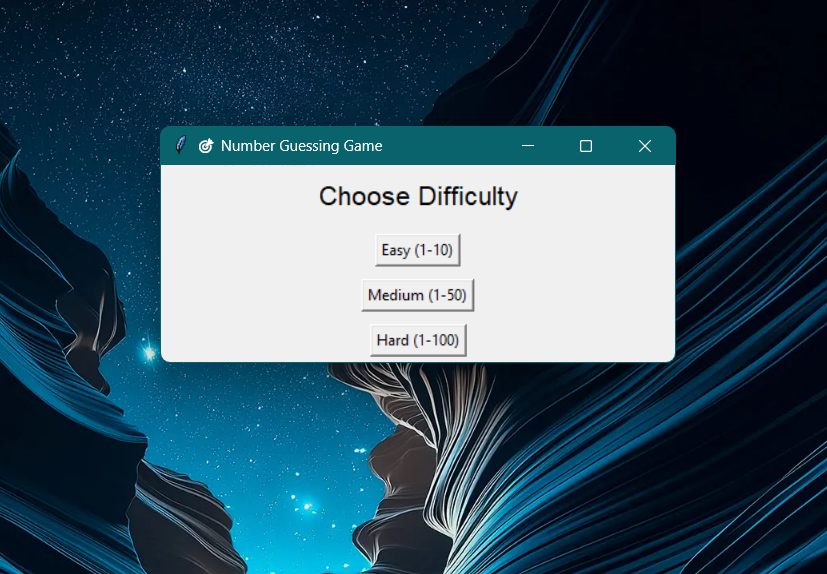
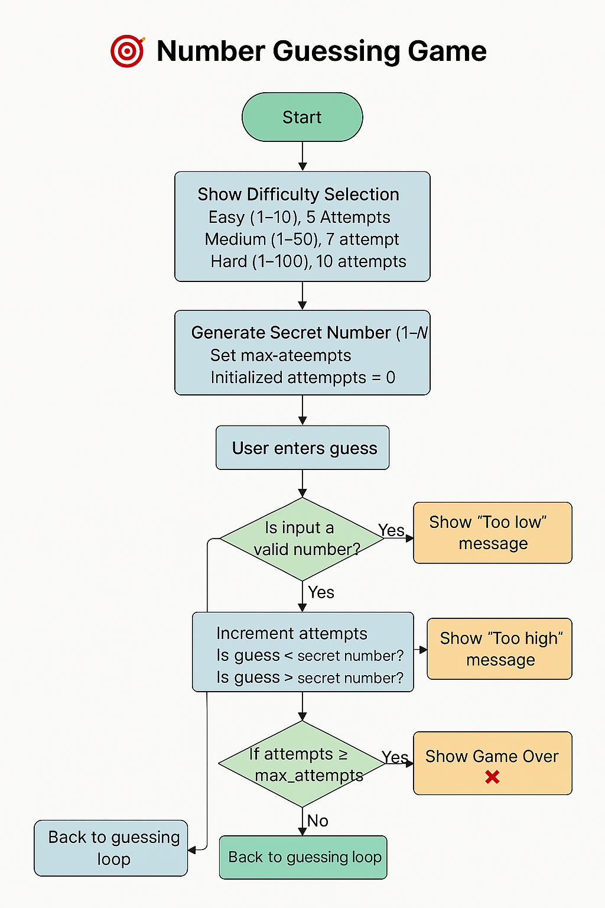

# 🎯 Number Guessing Game (Python + Tkinter)

A fun and interactive number guessing game built using Python's `tkinter` library. Choose a difficulty, guess the number within a limited number of attempts, and challenge yourself to beat your high score!

---

## 🚀 Features

- 🧠 Three difficulty levels:
  - Easy (1–10) – 5 attempts
  - Medium (1–50) – 7 attempts
  - Hard (1–100) – 10 attempts
- 🏆 High score tracking (lowest number of attempts)
- 🎨 Clean and user-friendly GUI using `tkinter`
- 🛡️ Input validation and helpful feedback
- 🔁 Replay option after each game

---

## 🖼️ Preview

## 📸 Screenshot



> Replace `screenshot.png` with your actual image file in the repo.

---

## 🔁 Game Flowchart



> Replace `flowchart.png` with your actual flowchart image in the repo.


---

## 🛠️ How to Run

### 1. Clone the Repository
```bash
git clone https://github.com/yourusername/number-guessing-game.git
cd number-guessing-game
```

### 2. Run the Game
```bash
python guessing_game.py
```

> Make sure Python 3 is installed on your system.

---

## 📂 File Structure

```
number-guessing-game/
│
├── guessing_game.py      # Main game code
├── preview.png           # Screenshot (optional)
└── README.md             # Project documentation
```

---

## ✅ Requirements

- Python 3.x
- No external libraries required (uses built-in `tkinter` and `random`)

---

## 📌 Future Enhancements (Optional Ideas)

- Dark mode toggle 🌙
- Sound effects 🎵
- Track win/loss ratio 📊
- Keyboard shortcuts ⌨️

---

## 📄 License

This project is licensed under the MIT License. Feel free to use, modify, and share it.

---

## 🤝 Contributing

Pull requests are welcome! For major changes, please open an issue first to discuss what you’d like to change.

---

## 🙋‍♂️ Author

**Gaurang Agarwal**  
[GitHub Profile](https://github.com/Gaurang1304)
